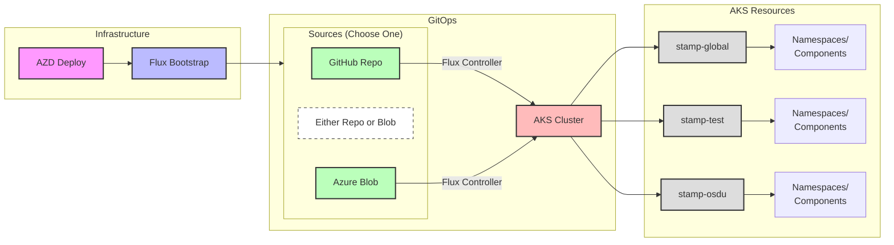
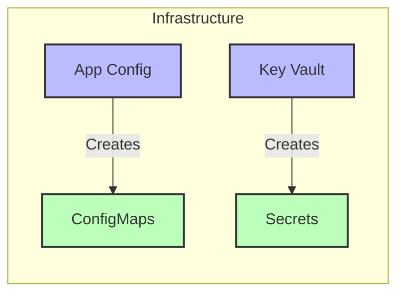

**Purpose and Scope**

This document outlines how cluster software is managed (GitOps) through a **Flux Configurations** after infrastructure deployment. It describes the post-infrastructure software deployment process, and structure including:

- Software configuration structure and management
- Helm chart organization and deployment
- Configuration retrieval from App Config and Key Vault
- Environment-specific deployments via stamps

The scope covers the complete software deployment lifecycle after infrastructure provisioning, including configuration management, secret handling, and multi-environment deployment strategies.

**Deployment Flow**



**Configuration Flow**


**Software Structure**

A software package (component) is a directory that contains the configuration for a component.

1. **Directory Pattern Overview**

   ```
   software/
   ├── stamp-{name}/          # Environment Stamp Definitions
   │   └── kustomization.yaml # Defines what to install
   │
   └── {component}/           # Software Package Definitions
       ├── namespace.yaml     # Namespace isolation
       ├── operator.yaml      # Optional operator config
       ├── instance.yaml      # Helm Release definition
       └── vault-secrets.yaml # Optional secrets config
   ```

2. **Stamp Pattern**

   - Purpose: Define complete environment configurations
   - Naming: Prefixed with `stamp-*` (e.g., `stamp-global`, `stamp-test`)
   - Structure:
     ```yaml
     # stamp-{name}/kustomization.yaml
     apiVersion: kustomize.config.k8s.io/v1beta1
     kind: Kustomization
     dependsOn:              # Optional dependencies on other stamps
       - name: stamp-global  # Example dependency
     resources:              # Components to install
       - ../component1       # Reference to software package
       - ../component2       # Installation order matters
     ```

3. **Software Component (Package) Pattern**

   - Purpose: Define complete component configuration
   - Naming: Descriptive of function (e.g., `database`, `cache`)
   - Standard Files:
     - `namespace.yaml`: Component isolation
     - `instance.yaml`: HelmRelease configuration
     - `operator.yaml`: Optional operator setup
     - `vault-secrets.yaml`: Optional secret management
   - Dependencies:
     ```yaml
     # instance.yaml example pattern
     apiVersion: helm.toolkit.fluxcd.io/v2beta1
     kind: HelmRelease
     metadata:
       name: {component-name}
     spec:
       dependsOn:           # Optional dependencies
         - name: other-component
           namespace: other-namespace
     ```

4. **Implementation Example: Sample Application with Database**
   ```
   software/
   ├── stamp-global/           # Global environment
   │   └── kustomization.yaml  # Installs cert-manager first
   │
   ├── stamp-test/            # Test environment
   │   └── kustomization.yaml # Installs sample app and database
   │
   ├── sample/               # Sample Application Package
   │   ├── namespace.yaml    # Creates sample namespace
   │   └── release.yaml      # Helm release for sample app
   │
   └── database/            # PostgreSQL Package
       ├── namespace.yaml    # Creates postgresql namespace
       ├── operator.yaml     # Installs database operator
       ├── instance.yaml     # Configures database instance
       └── vault-secrets.yaml# Manages database credentials
   ```

   Example Configurations:
   ```yaml
   # stamp-test/kustomization.yaml
   dependsOn:
     - name: stamp-global    # Wait for global components
   resources:
     - ../database          # Install database first
     - ../sample           # Then install sample app

   # sample/release.yaml
   apiVersion: helm.toolkit.fluxcd.io/v2
   kind: HelmRelease
   metadata:
     name: test-sample
     namespace: flux-system
   spec:
     targetNamespace: sample
     chart:
       spec:
         chart: ./charts/sample
     dependsOn:
       - name: postgresql-database  # Wait for database

   # database/instance.yaml
   apiVersion: helm.toolkit.fluxcd.io/v2beta1
   kind: HelmRelease
   metadata:
     name: postgresql-database
   spec:
     dependsOn:
       - name: cert-manager  # Wait for certificates
     chart:
       spec:
         chart: ./charts/postgresql
   ```

This example demonstrates:
- Multiple component installation
- Component dependencies (cert-manager → database → sample app)
- Different component complexities (simple vs. complex packages)
- Stamp-based environment configuration

**Key Components**

1. **Flux System**
   - Installed via AZD in `flux-system`
   - Monitors Git repository
   - Manages HelmReleases

2. **Component Configuration**
   - `namespace.yaml`: Kubernetes namespace
   - `operator.yaml`: Component operator setup
   - `instance.yaml`: HelmRelease referencing charts
   - `vault-secrets.yaml`: Secret management

3. **Helm Charts**
   - Located in `charts/` directory
   - Contains K8s manifest templates
   - Configurable via values.yaml
   - Referenced by HelmReleases

4. **Configuration Management**
   - AppConfigurationProvider creates ConfigMaps
   - Vault CSI driver mounts secrets
   - Values injected into Helm releases
   - Environment-specific settings

**Implementation**

1. **Namespace Management**
   - Dedicated namespaces per component
   - Controlled by Flux Kustomizations
   - Hierarchical organization

2. **Helm Deployments**
   - HelmRelease defines installation config
   - References local chart in `charts/` directory
   - Values from ConfigMaps or KeyVault
   - Supports dependencies between releases
   - Automated reconciliation

3. **Security**
   - KeyVault integration via CSI
   - Workload Identity enabled
   - Certificate management
   - RBAC configurations

**Testing**

1. **Validation**
   - Helm lint and template testing
   - GitOps sync verification
2. **Environments**
   - Feature testing in dev/staging

**Future Work**

- Automated image updates
- Enhanced chart reusability
