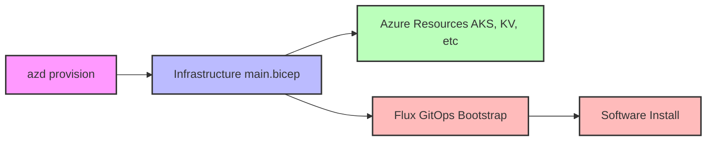

**Purpose and Scope**

This document details how Azure resources are provisioned using Azure Developer CLI (azd) with Bicep. It focuses on infrastructure provisioning only, with software deployment handled separately through GitOps. It covers:
- AKS deployment with managed features and extensions
- Supporting Azure resources (Key Vault, App Config, Monitor, etc.)
- Identity and security configuration (Managed Identity, Workload Identity)
- Infrastructure-level configuration management
- Observability setup (Prometheus, Grafana)

The scope is specifically limited to infrastructure provisioning via `azd provision`, excluding application building and deployment which are handled through GitOps.

**Core Components**

1. **Azure Kubernetes Service (AKS)**
   - Primary managed Kubernetes platform
   - Enabled Features:
     - Workload Identity
     - Azure CNI Overlay Networking
     - Cilium Data Plane
     - Azure Monitor Integration
   - Managed Extensions:
     - Flux for GitOps
     - App Configuration Provider
     - Azure Key Vault CSI Provider
     - Istio Service Mesh
     - Azure Policy
     - Prometheus Metrics

2. **Supporting Resources**
   - Managed Identity with Federation
   - Azure Monitor (Prometheus/Grafana)
   - Key Vault for Secrets
   - App Configuration for Settings
   - Storage Account (optional GitOps source)
   - Container Registry
   - Log Analytics Workspace

**Deployment Flow**

**Azure Developer CLI Usage**

While Azure Developer CLI (azd) supports full application lifecycle including:
- Infrastructure provisioning (`azd provision`)
- Application building (`azd build`)
- Application deployment (`azd deploy`)
- Combined operations (`azd up`)

This architecture specifically uses:
- Only `azd provision` for infrastructure deployment
- GitOps (Flux) handles all software deployment
- No application building or deployment through azd
- No responsibility for software builds

This separation allows:
- Clear infrastructure vs. application concerns
- GitOps-driven software deployment
- Independent software lifecycle management
- Simplified infrastructure updates

**Configuration Management**
1. **Azure App Configuration**
   - Stores non-sensitive configuration values
   - Environment-specific settings
   - Feature flags and application settings
   - Used by software components via ConfigMaps

2. **Azure Key Vault**
   - Stores sensitive configuration
   - Credentials and connection strings
   - Certificates and encryption keys
   - Accessed by software via CSI driver

**Identity and Security**
1. **Managed Identity**
   - User-assigned identity for AKS
   - Federated credentials for namespaces
   - Workload Identity integration
   - RBAC role assignments

2. **Network Security**
   - Private networking where possible
   - Network policies and ACLs
   - Service mesh integration

**Monitoring and Observability**
1. **Azure Monitor**
   - Managed Prometheus metrics
   - Managed Grafana dashboards
   - Log Analytics integration
   - Diagnostic settings

**Implementation Notes**
1. **Azure Developer CLI (azd)**:
   - `azd provision`: Infrastructure deployment only
   - `azd env`: Environment management
   - `azd down`: Resource cleanup

2. **Infrastructure Management**:
   - Bicep defines resource state
   - GitOps configuration included
   - Built-in role assignments
   - Configuration values populated to App Config
   - Secrets stored in Key Vault

**Testing**
1. **Validation**:
   - Bicep linting and security scans
   - Infrastructure deployment testing
2. **Integration**:
   - End-to-end environment validation
   - GitOps sync verification
